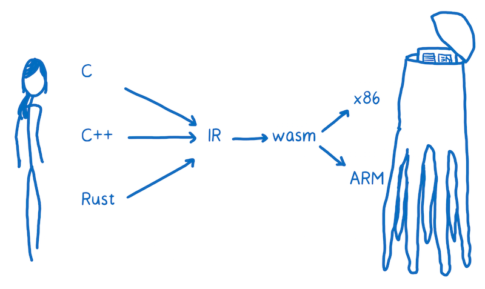
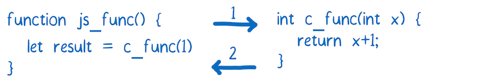
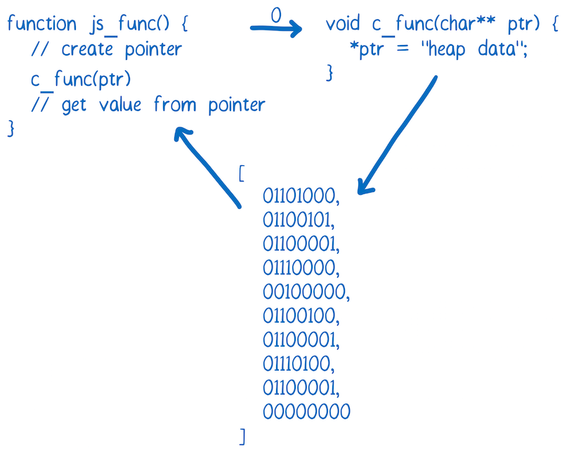
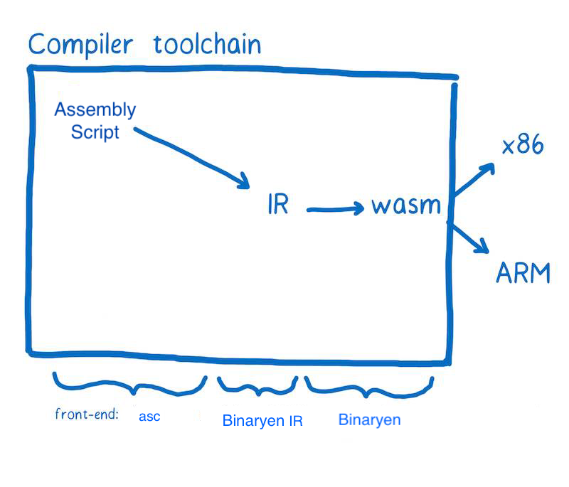

# JavaScript性能历史
1995 年 JavaScript 诞生, 2008年，人们称之为浏览器性能大战的时期开始。很多浏览器加入了即时编译器，又称之为JITs。在这种模式下，JavaScript在运行的时候，JIT 选择模式然后基于这些模式使代码运行更快。
这些 JITs 的引入是浏览器运行代码机制的一个转折点: JavaScript 的运行速度快了10倍。

现在 WebAssembly 可能是的另一个转折点。

# WebAssembly

WebAssembly 是一种新的字节码格式，它是一个概念机上的机器语言，不是在一个真正的可在物理机上运行的机器语言。浏览器下载 WebAssembly代码后，需要把 WebAssembly 代码转换成目标机器的汇编代码后才能执行。

也就是说 WebAssembly 并不是一门编程语言，而是一份字节码标准，需要使用高级编程语言编程，由源码编译出WebAssembly字节码放到 WebAssembly 虚拟机中才能运行。

主要特点
* 二进制字节码；
* 静态数据类型；
* 不支持垃圾回收, 手动管理内存（就像 C/C++）

## 编译到 .wasm 文件

将一种高级编程语言转换为一种汇编语言，需要为它创建到不同CPU的翻译器，转换成汇编语言。

如果将每一种高级语言都直接翻译成不同CPU的汇编语言，每个高级语言都去实现源码到不同平台的机器码的转换工作是重复的。大多数编译器会在高级语言和汇编语言之间多加一层，编译器将把高级语言翻译成一种更低级的语言，但比机器码的等级高。这就是中间代码（IR）。高级语言只需要生成底层虚拟机(LLVM)认识的中间语言(IR)。

假设我们想通过 C 来创建 WebAssembly, 首先使用 clang “前端”从 C 编译成 LLVM 中间代码（IR）,
接下去使用asm2wasm等"后端"工具让 LLVM 的 IR 变成 WebAssembly。

## 在JavaScript中加载WebAssembly组件

### 加载过程

目前JavaScript中加载一个WebAssembly组件有点复杂。

    function fetchAndInstantiate(url, importObject) {
        return fetch(url).then(response =>
            response.arrayBuffer()
        ).then(bytes =>
            WebAssembly.instantiate(bytes, importObject)
        ).then(results =>
            results.instance
        );
    }

### 使用WebAssembly模块

WebAssembly模块和JS模块之间存在重大差异。目前，WebAssembly 中的函数只能使用 WebAssembly 类型（整数或浮点数）作为参数或返回值。

对于任何更复杂的数据类型（如字符串），必须使用 WebAssembly 模块的内存。如果要在 JavaScript 和 WebAssembly 之间传递一个字符串，需要将字符串转换为等效的指针。

# AssemblyScript

TypeScript的子集

## 编译工具链

## 特点

* 严格静态数据类型
* 不能使用常规的js/ts库，可使用自带的标准库
* 提供js下的loader库

    const loader = require("@assemblyscript/loader")
    loader.instantiate(
    // Binary to instantiate
    fetch("optimized.wasm"), // or fs.readFileSync
                            // or fs.promises.readFile
                            // or just a buffer
    // Additional imports
    { ... }
    ).then({ exports } => {
    ...
    })

* runtime提供了一些辅助函数，帮助WebAssembly 指针和 JavaScript对象相互转换
    // AssemblyScript
    export function concat(a: string, b: string): string {
        return a + b
    }

    // JavaScript
    const { concat } = myModule.exports
    const { __allocString, __getString, __retain, __release } = myModule.exports

    function doConcat(aStr, bStr) {
        let aPtr = __retain(__allocString(aStr))
        let bPtr = __retain(__allocString(bStr))
        let cPtr = concat(aPtr, bPtr) // call with pointers
        let cStr = __getString(cPtr)
        __release(aPtr) // we are done with aPtr
        __release(bPtr) // we are done with bPtr
        __release(cPtr) // we are done with cPtr
        return cStr
    }

